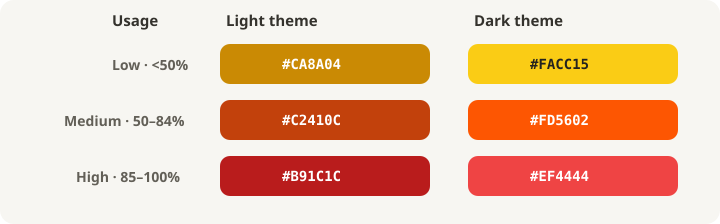

# CUM - Claude Usage Meter

Firefox WebExtension that adds a compact Claude-style usage meter directly under
the message composer on `claude.ai`.


It shows:

- Current 5-hour/session usage percentage and reset timing.
- Expandable five-hour, weekly, and extra-usage details when Claude provides them.
- A cautious five-hour burn forecast after at least ten minutes of same-window samples.
- Persistent Auto, Light, and Dark meter themes; Auto follows Claude's page appearance.
- Estimated current-conversation token count, clearly marked with `~`.
- Usage freshness, stale/error feedback, and manual refresh.
- Click-through to `https://claude.ai/settings/usage`.

## Theme Colors

Auto uses the Light or Dark palette based on Claude's current page appearance.
The accent changes with five-hour usage: Low is below 50%, Medium is 50–84%,
and High is 85% or above.



| Usage level | Light theme | Dark theme |
| --- | --- | --- |
| Low | `#CA8A04` | `#FACC15` |
| Medium | `#C2410C` | `#FD5602` |
| High | `#B91C1C` | `#EF4444` |

## How It Works

The extension runs a content script on `claude.ai` and a background script with
access to Claude's same-origin internal API.

- The content script detects the current organization and conversation ID.
- Every 15 seconds at most, it asks the background script to refresh the estimated
  token count for the current conversation.
- The background script fetches Claude's conversation JSON, extracts message text,
  counts it locally with the vendored `gpt-tokenizer` `o200k_base` encoding, and
  stores the result in `browser.storage.local`.

No completion stream interception is used. The failed `webRequest` and injected
`fetch` interception paths have been removed.

## Install In Firefox

1. Open `about:debugging#/runtime/this-firefox`.
2. Click **Load Temporary Add-on...**.
3. Select `manifest.json` from this directory.
4. Open or refresh `https://claude.ai`.

The extension stores usage and token counts locally with `browser.storage.local`.
It does not send data to any external service.

The burn forecast also stays local. It needs multiple samples spanning at least
ten minutes, resets its history when Claude starts a new five-hour window, and is
presented as an estimate rather than a guaranteed limit time.

## Usage Sync Notes

Claude does not document a public browser API for usage limits. This extension
reads Claude's usage endpoint in the background, falls back to visible text on
`https://claude.ai/settings/usage`, and keeps that synced value cached locally.

If the meter says `open usage to sync`, click it once, let Claude's usage page
load, then return to chat.

Conversation token counts are estimates. They use `gpt-tokenizer`'s `o200k_base`
encoding as a local approximation because Claude's exact tokenizer is not exposed
in the page. The extension intentionally does not present an account-wide daily
token total because Claude does not expose a reliable value for it.

## Development

This extension has no bundler. The browser-ready tokenizer is vendored at
`src/lib/tokenizer.js` and loaded before `src/background.js` in `manifest.json`.

Run checks with:

```bash
node --check src/background.js
node --check src/content.js
node --check src/lib/tokenizer.js
node --test tests/usage-meter.test.js
node -e "JSON.parse(require('node:fs').readFileSync('manifest.json','utf8'))"
```
